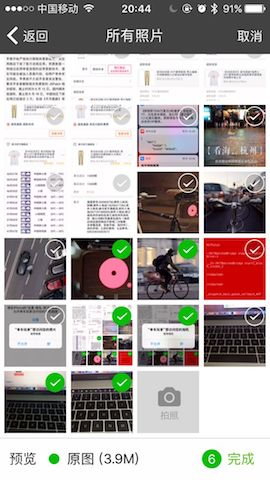

# cordova-plugin-ImagePicker
修改自 https://github.com/giantss/cordova-plugin-ImagePicker
主要是为了修改以及发布npm

一个支持多选，相册实现了拍照、预览、图片压缩等功能

## 功能

- 相册目录
- 多选图
- 相册内部拍照
- 预览选中的图片
- 图片压缩

## 安装要求

- Cordova Version >= 6.0.0
- Cordova-Android >= 6.0.0
- Cordova-iOS >= 4.0.0

## 安装

 - `cordova plugin add https://github.com/adam198824/cordova-plugin-ImagePicker.git --variable CAMERA_USAGE_DESCRIPTION="使用相机用于图片上传" --variable PHOTOLIBRARY_USAGE_DESCRIPTION="图片上传需要访问相册"`
 - `cordova plugin add cordova-plugin-adam-imagepicker  --variable CAMERA_USAGE_DESCRIPTION="使用相机用于图片上传" --variable PHOTOLIBRARY_USAGE_DESCRIPTION="图片上传需要访问相册"`


注意：Android 项目先不要直接 build ，见 [android注意事项](#android注意事项)。


## 效果图

| Android         | iOS          |
|:---------------:|:------------:|
|  |  |


```javascript

ImagePicker.getPictures(function(result) {
    alert(JSON.stringify(result));
}, function(err) {
    alert(err);
}, { 
    maximumImagesCount : 9, 
    width : 1920, 
    height : 1440, 
    quality : 100 
});
```

返回结果如下：
```
{
    "images": [{
        "path": "/data/user/0/com.pushsoft.im2/cache/ImagePicker/152783817455118.jpg",
        "width": 720,
        "height": 1280,
        "size": 104871 // 文件体积(单位：字节)
    }, {
        "path": "/data/user/0/com.pushsoft.im2/cache/ImagePicker/152783817464525.jpg",
        "width": 720,
        "height": 1280,
        "size": 109873
    }],
    "isOrigin": false // 是否原图
}
```

ionic 中使用本插件，需要声明： `declare let ImagePicker:any`


## 参数含义

| 配置参数            | 参数含义                   |
|:------------------:|:-------------------------:|
| maximumImagesCount | 多选限制数量，默认为9        |
| width              | 设置图片的width，默认为1920   |
| height             | 设置图片的height，默认为1440  |
| quality            | 图片质量 默认80            |

### 注意：

- 参数都是可选的，不传则使用默认值；
- 如果 width > 0 且 height > 0：Android 下压缩的图可能比原图大或者压缩率不高（比如原图4MB，压缩后也有2MB），可以 quality 设置低一些，比如 50；iOS 下会忽略 quality 参数；
- 如果 width < 0 或 height < 0：那么插件返回压缩图，压缩逻辑接近于微信，自动选取合适的分辨率和压缩品质，推荐使用这种方式。压缩库使用的是 [Luban](https://github.com/Curzibn/Luban) 和 [Luban-iOS](https://github.com/GuoZhiQiang/Luban_iOS)。如果遇到压缩不清晰等问题，请到他们的项目上提 issues；
- 运行时，选图界面上有“原图”单选按钮，选上之后，返回的图片是未压缩的原图

## android注意事项

- 先移除安装过的旧版插件

- 如果 build 报下面的错
    ```
    error: resource android:attr/dialogCornerRadius not found
    error: resource android:attr/fontVariationSettings not found
    error: resource android:attr/ttcIndex not found
    ```

    请使用 [cordova-android-support-gradle-release](https://github.com/dpa99c/cordova-android-support-gradle-release) 这个插件统一项目中的 Android Support 库版本：
    ```
    $ cordova plugin add cordova-android-support-gradle-release  --variable ANDROID_SUPPORT_VERSION={required version}
    ```
    其中`{required version}` 值为类似 `25.+`，`26.+`，`27.+` 这种。

- 如果你用的是 低版本 Cordova 和 Gradle，会报错不支持`implementation`
    Cordova 7.1.0 及以下版本（对应Cordova-Android@6.3.0及以下版本），请将 `cordova-plugin-ImagePicker\src\android\imagepicker.gradle` 里面的 `implementation` 修改为 `compile`，
因为低版本的 Cordova-Android 使用的是低版本的 Gradle, 不支持 `implementation`。

- 如果还是 build 不成功
    ```
    $ cordova platform rm android
    ```
    或
    ```
    $ cordova platform rm ios
    ```
    移除旧的平台，然后重新 add


## 参考项目

### 多选图片项目
- [nanchen2251/ImagePicker](https://github.com/nanchen2251/ImagePicker) (Android)
    - [jeasonlzy/ImagePicker](https://github.com/jeasonlzy/ImagePicker)
- [banchichen/TZImagePickerController](https://github.com/banchichen/TZImagePickerController) (iOS)

### 图片压缩库
- [nanchen2251/CompressHelper](https://github.com/nanchen2251/CompressHelper) (Android)
- [Curzibn/Luban](https://github.com/Curzibn/Luban) (Android)
- [GuoZhiQiang/Luban_iOS](https://github.com/GuoZhiQiang/Luban_iOS) (iOS)
